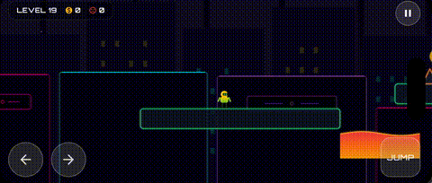
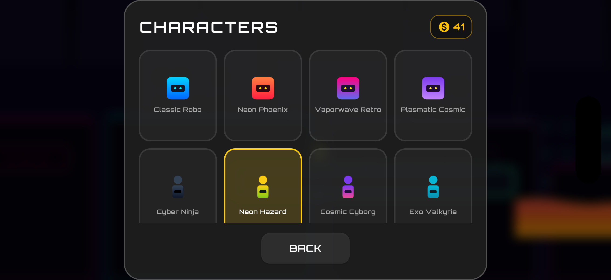

# Fall Again

<p align="center">
  
  
  
</p>

<p align="center">
  <b>A chaotic, reflex-testing 2D platformer built with Flutter and the Flame Engine.</b><br/>
  <i>One wrong step and you're falling again.</i>
</p>

---

## Overview

**Fall Again** throws you into a retro-futuristic world full of deceptive platforms, hidden traps, and razor-thin margins for error. Choose your character, pick a level, and see how far your reflexes (and patience) can take you. Every run is a test of timing, memory, and nerve.

---

## Gameplay Preview

<p align="center">
  
</p>

---

## Screenshots

<p align="center">
  
  
  
</p>
<p align="center">
  
  
  
</p>

---

## Features

| | |
|---|---|
| **Physics-Based Gameplay** | Smooth, physics-driven movement and precise collision detection powered by Flame. |
| **Multiple Levels** | Hand-crafted levels with escalating difficulty and unique layouts. |
| **Character Selection** | Choose from a roster of unlockable characters. |
| **Hazards and Collectibles** | Dodge spikes and traps while collecting items to boost your score. |
| **Immersive Audio** | Dynamic background music and sound effects via `flame_audio`. |
| **Persistent Progress** | Level progress and unlocked characters saved locally with `shared_preferences`. |
| **Landscape Mode** | Enforced immersive landscape orientation for a true mobile gaming feel. |

---

## Tech Stack

| Category | Technology |
|---|---|
| Framework | [Flutter](https://flutter.dev/) (Dart) |
| Game Engine | [Flame](https://pub.dev/packages/flame) |
| Audio | [Flame Audio](https://pub.dev/packages/flame_audio) |
| Typography | [Google Fonts — Orbitron](https://pub.dev/packages/google_fonts) |
| Local Storage | [Shared Preferences](https://pub.dev/packages/shared_preferences) |

---

## Getting Started

### Prerequisites

- [Flutter SDK](https://docs.flutter.dev/get-started/install) `>= 3.0.0`
- Dart SDK
- An Android/iOS emulator or a physical device

### Installation

```bash
# 1. Clone the repository
git clone https://github.com/abhaysingh-10/FallAgain.git
cd FallAgain

# 2. Install dependencies
flutter pub get

# 3. Run the game
flutter run
```

---

## Project Structure

```
lib/
├── game/         # Core Flame game loop (FallAgainGame)
├── components/   # Game entities: players, platforms, hazards, collectibles, background
├── levels/       # Level loading and layout logic
├── managers/     # AudioManager, SaveManager, and other game-state managers
└── ui/           # Flutter UI overlays: Main Menu, Pause Menu, Level Selection, etc.
```

---

## Roadmap

- [ ] Additional levels and biomes
- [ ] More unlockable characters
- [ ] Global leaderboard
- [ ] Custom level editor

---

## Acknowledgements

This project is a personal recreation inspired by **Level Devil** — a rage-baiting platformer known for its deliberately unfair traps and trick-based level design. Fall Again pays homage to that same "one wrong step and you're doomed" philosophy, reimagined with a retro-futuristic aesthetic in Flutter and Flame.

This is a fan-inspired independent project and is not affiliated with or endorsed by the creators of Level Devil.